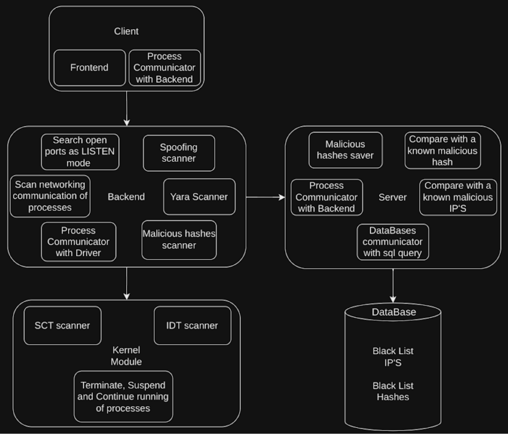

# Linux-Defender
In this project you can find a variety of tools 
that are used by the antivirus to investigate processes / files in the system 
for identifying and treating spywares / malwares.

The antivirus works on several ways related to the system:
- Scanning the communication in the system
- Scanning content of files
- Scanning operations performed on the system tables (such as sct / idt)

The antivirus can help monitor unwanted actions and communication in the system or infected / malicious files.

# scanning environments 
### yara
Yara is set of rules that describe specific malicious content of functions / files, we use it to detect that malicious functions and files to treating them.

### hashes
Every file has it own hash for his content, we get that hash with the sha-256 algorithem and check if its already exists on the malicious hashes table.

### open ports
Here we scan if there is some specific open ports on your system, such as 22-ssh, 23-telnet etc...
because some time viruses or torjan hourses use that ports to open backdor on the system.

### spofing
This category include two types of attacks that spoof a request for a real service but are not at all for the purposes of receiving a service, one is DOS which is used by two to disable a certain service and the other is Brute-Force which is used to obtain a password related to specific service on the system.

### malicious network
The network usaely used for sending your data to malicious destinations ip's, so in this scan we check and kill every communication with that malicious destinations.

### sct
Sometimes malwares hook the syscall table for hiding them selfes or for just hurt your system, so this scan make sure that your syscall table wont be hooked

### idt
Same as the sct scan here we scan the idt scan because malwares also hook the interrupt table to control the cpu flow for they own needs.

# scan types
### file scan
In this scan the antivirus scan only single file with the yara scanner and the hashes detector scanner.

### folder scan
When you need to scan all the files in specific folder you can use that scan to go over all the files in the folder and scan them.

### quick scan
This scan go over set of folders and scan all the files in that folders,
this scan also scan the sct & idt tables with the hooking detector,
then it scan the open ports, malicious network and spofing scan.

### full scan
This scan contains both the quick scan and another more folders and it go over all the files in that folders and the sub files at the sub folders for full scanning of system.


# Architecture


# Sytem protocol
In this project there are several components that need to communicate with each other, therefore there is a protocol of the system that describes how the communication between the various components should be carried out.
## global message structure


## Messages in Json format
### Backend -> Server
```
112 - Ask for IP scan
{"IP":"(IP address)"}

113 - Ask for HASH scan
{"HASH":"(HASH code)"}

114 - Ask for saving IP
{"IP": "(IP address", "type" : "0-clear, 1-malcious"}

115 - Ask for saving malicious HASH
{"HASH":"(HASH code)", "type" : "0-clear, 1-malcious"}
```

### Server -> Backend
```
212 - Reply if the IP is malicious or clear
{"IP status":"malicious \ clear"}

213 - Reply if the HASH is malicious or clear
{"HASH status":"malicious \ clear"}

214 - Reply if the IP saving was successful
{"status":"1 (success) \ 0 (fail)"}

215 - Reply if the HASH saving was successful
{"status":"1 (success) \ 0 (fail)"}
```

### Client -> Backend
```
100 - Ask for Start scanning
{"type":"scan type (1, 2, 3 ...)", "path": "(path for scan)"}

101 - Ask for suspicious process list
{"status":"1"}

102 - Ask for suspends process list
{"status":"1"}

103 - Ask for free process from block
{"ID":"Procees ID that reference to the Process PID"}

104 - Ask for block process
{"ID":"Procees ID that reference to the Process PID"}
```

### Backend -> Client
```
200 - Send scan results
{"status": 1, "sctResults":"(hook entry in sct table / -1)",
"idtResults": "(hook entry in idt table / -1)",
"packetsResults": "(list of malicious processes networking with IPs)",
"openPortsResults": "(list of open ports)",
"spoofingResults": "(list of IPs that spoof specific ports)",
"yaraResults": "(Details about processes by yara rules)",
"hashesResults": "(malicious hashes that found)"}

201 - Send suspicious process list
{"process names":"proc_1, proc_2, proc_3 ..."}

202 - Send suspends process list
{"process names":"proc_1, proc_2, proc_3 ..."}

203 - Free process from block successfully
{"status":"1 (success) \ 0 (fail)"}

204 - block process successfully
{"status":"1 (success) \ 0 (fail)"}
```
